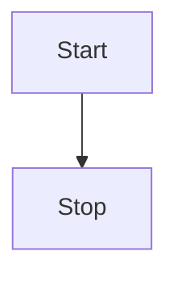
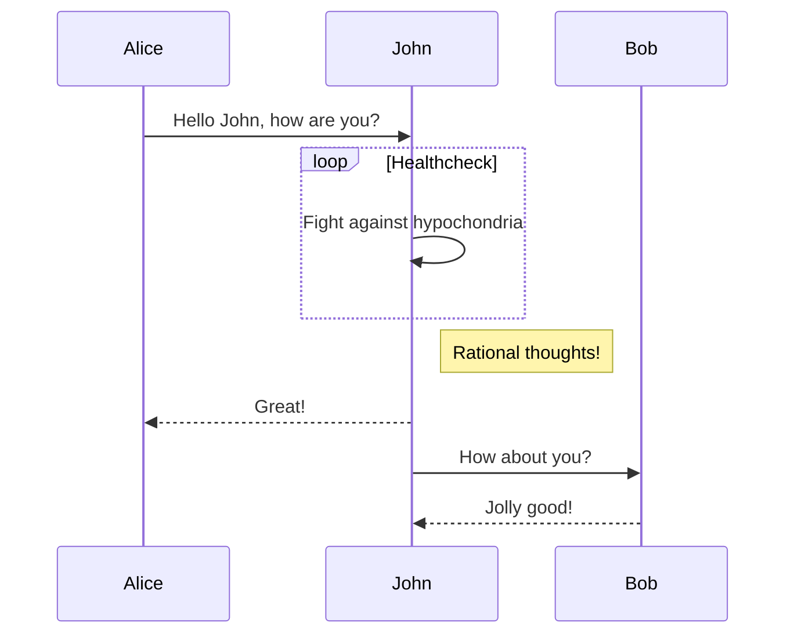
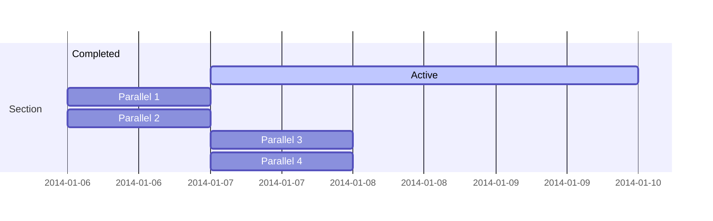

# 内置第三方插件能力

部分内置组件（插件），来源 [vitepress.yiov.top](https://vitepress.yiov.top/plugin.html) 推荐

## oml2d - 看板娘集成
* Type：[oml2dOptions](https://oml2d.com/options/Options.html)

为网站提供一个 Live2D 看板组件。

:::tip 一点说明
通过内置 [oh-my-live2d](https://oml2d.com) 实现, 可以通过 `oml2d` 选项配置。

通过这个能力可以快速加入并定制属于自己的看板娘, 开启只需要为其传递一个 [配置选项](https://oml2d.com/options/Options.html) 即可
:::

以下是一个简单的使用示例，当模型加载成功时它将出现在您网站的左下角。

```ts
const blogTheme = getThemeConfig({
  oml2d: {
    mobileDisplay: true,
    models: [
      {
        path: 'https://registry.npmmirror.com/oml2d-models/latest/files/models/Senko_Normals/senko.model3.json'
      }
    ]
  }
})
```
效果图如下


之后您还可以前往[配置选项](https://oml2d.com/options/Options.html)查阅更多自定义内容

:::tip 版本说明
由于时间原因，主题内置的版本不一定都是最新的，可以通过 `resolutions` 配置指定要使用的版本。

下面是使用示例，配置在 `package.json` 中，其它依赖覆盖版本也是这样操作。
```json
{
  "resolutions": {
    "oh-my-live2d": "^0.17.0"
  }
}
```
:::

## task-checkbox
* Type: `boolean | TaskCheckbox`

支持渲染 markdown 任务列表，内置 [markdown-it-task-checkbox](https://github.com/linsir/markdown-it-task-checkbox) 插件提供支持

* [ ] 🥔 TODO
* [ ] 真不戳
* [x] 内置任务列表

语法如下
```md
* [ ] 🥔 TODO
* [ ] 真不戳
* [x] 内置任务列表
```

默认开启，你可以进一步配置

:::code-group
```ts [① 关闭]
const blogTheme = getThemeConfig({
  taskCheckbox: false
})
```
```ts [② 进一步配置]
const blogTheme = getThemeConfig({
  taskCheckbox: {
    // refer https://github.com/linsir/markdown-it-task-checkbox for options
  }
})
```
```ts [③ type]
interface TaskCheckbox {
  disabled?: boolean
  divWrap?: boolean
  divClass?: string
  idPrefix?: string
  ulClass?: string
  liClass?: string
}
```
:::

## timeline
* Type: `boolean`
* default: `true`

提供 markdown 时间线语法，在 vitepress 中使用 markdown 渲染时间线（时间轴）样式。

:::tip 一点说明
内置 [vitepress-markdown-timeline](https://github.com/HanochMa/vitepress-markdown-timeline) 实现
:::

效果如下

::: timeline 2023-05-24
- **do some thing1**
- do some thing2
:::

::: timeline 2023-05-23
do some thing3
do some thing4
:::

语法如下
```md
::: timeline 2023-05-24
- **do some thing1**
- do some thing2
:::

::: timeline 2023-05-23
do some thing3
do some thing4
:::
```

:::code-group
```ts [关闭]
const blogTheme = getThemeConfig({
  timeline: false
})
```
:::
## tabs
* Type: `boolean`

支持局部的`tabs`面板，**默认开启**

:::details 我之前手动安装配置了怎么办？
① package.json 中移除 vitepress-plugin-tabs 依赖

② .vitepress/theme/index.ts 中移除注册的组件`enhanceAppWithTabs`

③ （可选）`getThemeConfig` 中移除配置项`tabs`
:::
:::tip 一点说明
基于 [vitepress-plugin-tabs@0.2.0](https://www.npmjs.com/package/vitepress-plugin-tabs) 内置实现
:::

效果如下

:::=tabs
::tab1
一些内容

一些内容

一些内容

::tab2
一些内容 。。。
:::

简单的使用方式如下（效果如上面的示例）

```md
:::=tabs
::tab1
一些内容

一些内容

一些内容

::tab2
一些内容 。。。
:::
```

共享状态的使用方式如下

```md
:::=tabs=ab
::a
a content

::b
b content
:::

:::=tabs=ab
::a
a content 2

::b
b content 2
:::
```


:::=tabs=ab
::a
a content

::b
b content
:::

:::=tabs=ab
::a
a content 2

::b
b content 2
:::

不需要也可以关闭

```ts
// .vitepress/blog-theme.ts
const blogTheme = getThemeConfig({
  tabs: false
})
```

## Mermaid - 图表
* Type: `boolean`|`object`

>通过解析类 Markdown 的文本语法来实现图表的创建和动态修改。

:::tip 一点说明
基于 [vitepress-plugin-mermaid](https://github.com/emersonbottero/vitepress-plugin-mermaid) 实现
:::

简单语法如下，详细流程图语法见 [Mermaid 中文文档](https://github.com/mermaid-js/mermaid/blob/develop/README.zh-CN.md)

<pre>

</pre>


效果如下


**默认关闭**，可以通过设置 `mermaid: true` 开启，或进行进一步配置。

:::code-group
```ts [① 开启]
const blogTheme = getThemeConfig({
  mermaid: true
})
```
```ts [② 进一步配置]
const blogTheme = getThemeConfig({
  mermaid: {
    // refer https://mermaid.js.org/config/setup/modules/mermaidAPI.html#mermaidapi-configuration-defaults for options
  }
})
```
:::

下面看一下官方其它案例

**时序图**


**甘特图**



## UserWorksPage
* Type: `UserWorks`

用于作品列表展示

效果如下，详见 [个人作品展示](https://theme.sugarat.top/work.html)


新建一个`works.md`文件，放入以下内容
  
```md
---
layout: page
title: 个人作品展示
sidebar: false
outline: [2,3]
sticky: 1
---
<UserWorksPage />
```

内容配置方式如下

::: code-group

```ts [default]
const blogTheme = getThemeConfig({
  works: {
    title: '个人项目/线上作品',
    description: '记录开发的点点滴滴',
    topTitle: '举些🌰',
    list: [
      {
        title: '博客主题 @sugarat/theme',
        description: '基于 vitepress 实现的博客主题',
        time: {
          start: '2023/01/29'
        },
        github: {
          owner: 'ATQQ',
          repo: 'sugar-blog',
          branch: 'master',
          path: 'packages/theme'
        },
        status: {
          text: '自定义badge'
        },
        url: 'https://theme.sugarat.top',
        cover:
          'https://img.cdn.sugarat.top/mdImg/MTY3MzE3MDUxOTMwMw==673170519303',
        tags: ['Vitepress', 'Vue'],
        links: [
          {
            title: '一个简约风的VitePress博客主题',
            url: 'https://juejin.cn/post/7196517835380293693'
          }
        ]
      }
    ]
  }
})
```

```ts [type]
interface UserWorks {
  title: string
  description?: string
  topTitle?: string
  list: UserWork[]
}
interface UserWork {
  title: string
  description: string
  time:
  | string
  | {
    start: string
    end?: string
    lastupdate?: string
  }
  status?: {
    text: string
    type?: 'tip' | 'warning' | 'danger'
  }
  url?: string
  github?:
  | string
  | {
    owner: string
    repo: string
    branch?: string
    path?: string
  }
  cover?:
  | string
  | string[]
  | {
    urls: string[]
    layout?: 'swiper' | 'list'
  }
  links?: {
    title: string
    url: string
  }[]
  tags?: string[]
  top?: number
}
```

:::
