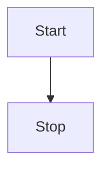
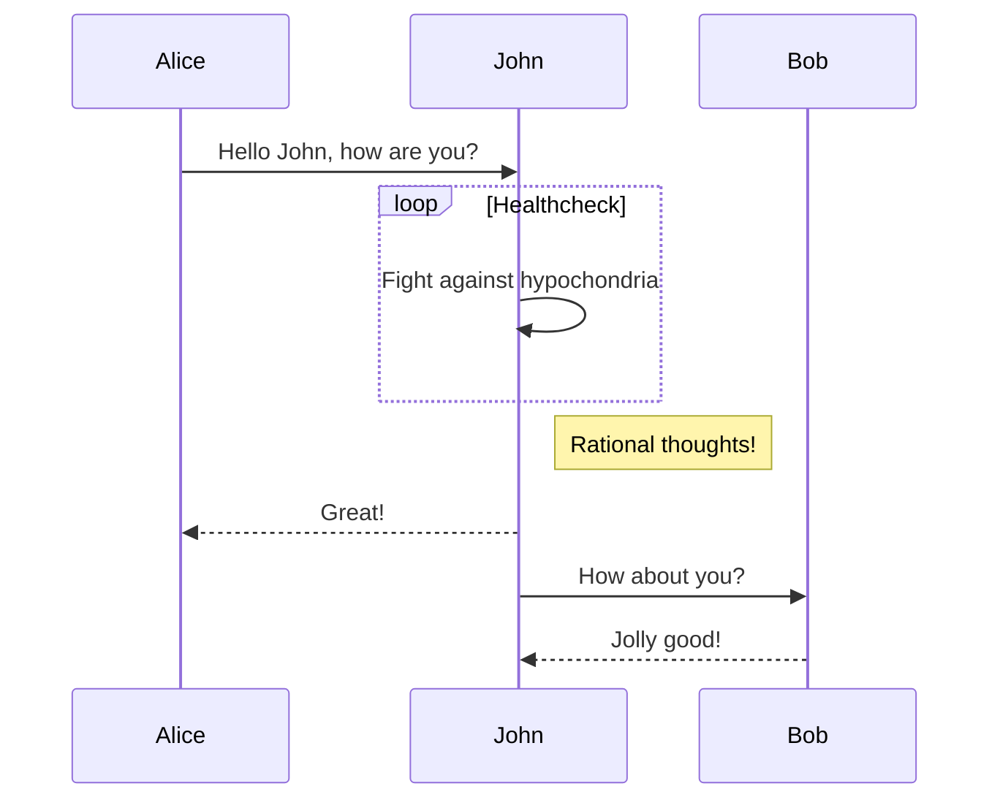
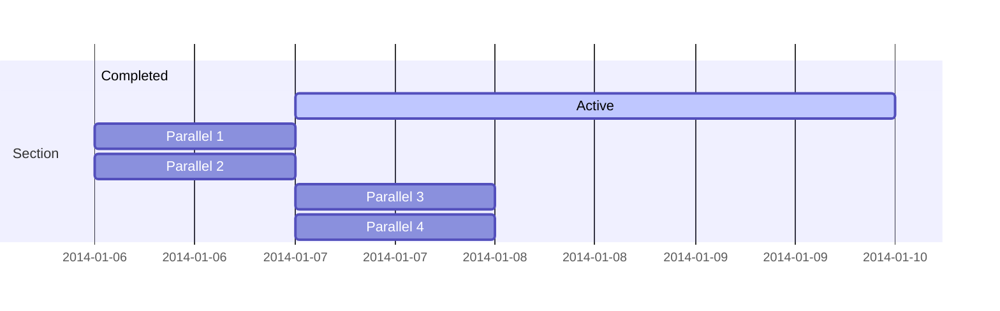

# Mermaid - 流程图

>通过解析类 Markdown 的文本语法来实现图表的创建和动态修改。

:::tip 一点说明
基于 [vitepress-plugin-mermaid](https://github.com/emersonbottero/vitepress-plugin-mermaid) 实现
:::

简单语法如下，详细流程图语法见 [Mermaid 中文文档](https://github.com/mermaid-js/mermaid/blob/develop/README.zh-CN.md)

<pre>

</pre>


效果如下


默认开启，可以通过`mermaid`进行进一步配置，或关闭

:::code-group
```ts [① 关闭]
const blogTheme = getThemeConfig({
  mermaid: false
})
```
```ts [② 进一步配置]
const blogTheme = getThemeConfig({
  mermaid: {
    // refer https://mermaid.js.org/config/setup/modules/mermaidAPI.html#mermaidapi-configuration-defaults for options
  }
})
```
:::

下面看一下官方其它案例

**时序图**


**甘特图**
